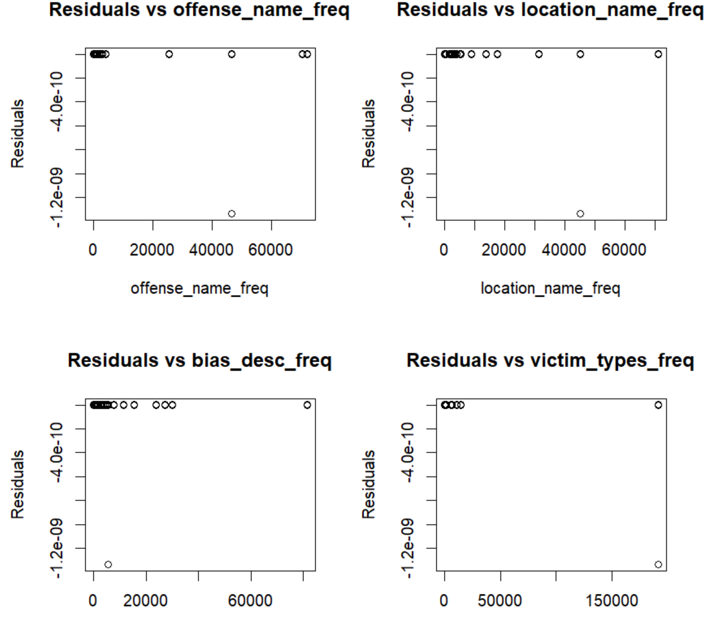

```{r, echo=FALSE, message=FALSE, warning=FALSE}
library(dplyr)
library(tidyr)
library(tidyverse)
library(ggplot2)
library(GGally)
library(Hmisc)
library(corrplot)
library(PerformanceAnalytics)
library(scales)
library(MASS)
library(gridExtra)
library(psych)
library(skimr)
library(caret)
```


# **Load the data**

```{r data-import, echo=FALSE}
git_url<-
  "https://raw.githubusercontent.com/GitableGabe/Data621_Data/main/"

```

## hate_crime.csv

```{r}

df_hate_crime <- 
  read.csv(paste0(git_url,"hate_crime.csv"))
head(df_hate_crime,n=3)

```

# Summary data

## df_hate_crime


### Summary
```{r, echo=FALSE}
summary(df_hate_crime)
```
### str

```{r, echo=FALSE}
str(df_hate_crime)
```

### skim

```{r, echo=FALSE}
print(skim(df_hate_crime))
```

### Binary Column and Count

```{r, echo=FALSE}

df_hate_crime <- df_hate_crime%>%
  dplyr::select(-c(adult_victim_count,juvenile_victim_count,adult_offender_count
                   ,juvenile_offender_count,total_individual_victims,
                   incident_date))

# add binary column to each dataset
df_hate_crime <- df_hate_crime %>%
  mutate(Antisemitic_crimes = ifelse(grepl("Anti-Jewish",
                                     bias_desc, ignore.case = TRUE), 1, 0))
# df_hate_crime <- df_hate_crime %>%
#   mutate(Violent = ifelse(grepl("*Assault*|*Abduction*|*Rape*|*Kidnapping*
#|*Murder*",
#                                      offense_name, ignore.case = TRUE), 1, 0))

# get counts

cnt_hate <- sum(df_hate_crime$Antisemitic == 1)
total_hate<-nrow(df_hate_crime)

cat("Number of Antisemitic column reports in hatecrime.csv is:",
    cnt_hate," out of ",total_hate,"\n")

```

# Data Transformation

## Changing Categorical Values to Numeric 

**Categorical values are transformed using there frequency counts**

```{r}
df_hate_corr <- df_hate_crime
# frequency_map <- table(df_hate_crime$incident_id)
# df_hate_crime$incident_id_freq <- frequency_map[df_hate_crime$incident_id]

add_freq <- function(data, column_name) {
  # Compute frequencies, including NAs
  frequency_map <- table(data[[column_name]], useNA = "always")
  
  # Create a new column with frequency encoding (including NAs)
  new_col_name <- paste0(column_name, "_freq")
  data[[new_col_name]] <- frequency_map[match(data[[column_name]], names(frequency_map))]
  
  return(data)
}

# Loop through all columns and add frequency encoding columns (including NAs)
for (col in names(df_hate_corr)) {
  df_hate_corr <- add_freq(df_hate_corr, col)
}


```

```{r}
# selecting only numeric columns
df_hate_corr<-df_hate_corr%>%
  dplyr::select(matches("_freq"), matches("^Anti"))
```

## Train | Test data creation

```{r}
set.seed(123)

train_indices <- sample(seq_len(nrow(df_hate_corr)), 0.8 * nrow(df_hate_corr))

# Create training dataset
df_hate_train <- df_hate_corr[train_indices, ]

# Create test dataset
df_hate_test <- df_hate_corr[-train_indices, ]
```

```{r, echo=FALSE}
rm(git_url,col,total_hate,train_indices,cnt_hate, add_freq)
```

## Visual

### Train Histogram

```{r, fig.height=18,fig.width=18,fig.ncol=1}
df_hate_train %>%
  dplyr::select( ends_with("_freq"))%>%
  gather() %>% 
  ggplot(aes(x = value)) + 
  geom_histogram(fill = "cadetblue") + 
  facet_wrap(~key, scales = "free")
```

### Test Histogram

```{r, fig.height=18,fig.width=18,fig.ncol=1}
df_hate_test %>%
  dplyr::select( ends_with("_freq"))%>%
  gather() %>% 
  ggplot(aes(x = value)) + 
  geom_histogram(fill = "cadetblue") + 
  facet_wrap(~key, scales = "free")
```

### Correlation plots

#### df_hate_crime

```{r, fig.height=15,fig.width=15,fig.ncol=1, echo=FALSE, warning=FALSE}
ggcorr(df_hate_crime%>%
                     dplyr::select(-matches("_freq")))
```

#### df_hate_train

```{r, echo=FALSE, warning=FALSE}

(cor_matrix <- cor(df_hate_train))
```
## Weighted Values 

Our attempt to get the weighted values, hindered our R Notebooks ability to knit. A visual assessment of the plot displayed, indicated a 'fan-like' or 'cone-shaped' pattern was lacking, and therefore the attributes lacked the presence of heteroskedasticity. Ultimately the decision was made to not pursue the weighted values.

             #```{r,fig.height=6,fig.width=6,fig.ncol=1,}
             # Fit a linear regression model with all variables
             lm_model <- lm(Antisemitic_crimes ~ ., data = df_hate_train)
             
             # Extract residuals
             residuals_all <- residuals(lm_model)
             
             # Plot residuals for each predictor variable
             par(mfrow = c(2, 2))  # Set up a 2x2 grid for subplots
             
             for (variable in names(df_hate_train)) {
               if (variable != "Antisemitic_crimes") { 
               # Exclude the response variable
                 plot(df_hate_train[[variable]], residuals_all,
                      main = paste("Residuals vs", variable),
                      xlab = variable, ylab = "Residuals")
               }
             }
             
             # Reset the plotting parameters
             par(mfrow = c(1, 1))
             #```


<div style="display: flex; flex-wrap: wrap; justify-content: space-around;">

{ width=45% }
{ width=45% }
{ width=45% }
{ width=45% }
{ width=45% }
{ width=45% }


</div>


## Box-Cox Transformation

### df_hate_train

```{r, echo=FALSE}
df_hate_train<-as.data.frame.matrix(df_hate_train)
```

```{r}
# Convert a DataFrame column to a list
freq_list <- as.numeric(as.list(df_hate_train$data_year_freq))

#find optimal lambda for Box-Cox transformation 
bc <- boxcox(freq_list~ 1, lambda = seq(-2,2,0.1))
lambda_data_year <- bc$x[which.max(bc$y)]

# Apply the Box-Cox transformation
norm_data_year_freq <- (freq_list^lambda_data_year-1)/lambda_data_year

rm(bc,freq_list)
# hist(data_year_freq_norm )
# hist(df_hate_train$data_year_freq)
```


```{r}
# Convert a DataFrame column to a list
freq_list <- as.numeric(as.list(df_hate_train$ori_freq))

#find optimal lambda for Box-Cox transformation 
bc <- boxcox(freq_list~ 1, lambda = seq(-2,2,0.1))
lambda_ori <- bc$x[which.max(bc$y)]

# Apply the Box-Cox transformation
norm_ori_freq <- (freq_list^lambda_ori-1)/lambda_ori

rm(bc,freq_list)
# hist(data_year_freq_norm )
# hist(df_hate_train$data_year_freq)
```

```{r}
# Convert a DataFrame column to a list
freq_list <- as.numeric(as.list(df_hate_train$pug_agency_name_freq))

#find optimal lambda for Box-Cox transformation 
bc <- boxcox(freq_list~ 1, lambda = seq(-2,2,0.1))
lambda_pug_agency_name <- bc$x[which.max(bc$y)]

# Apply the Box-Cox transformation
norm_pug_agency_name_freq <- (freq_list^lambda_pug_agency_name-1)/lambda_pug_agency_name

rm(bc,freq_list)
# hist(data_year_freq_norm )
# hist(df_hate_train$pug_agency_name_freq)
```

```{r}
# Convert a DataFrame column to a list
freq_list <- as.numeric(as.list(df_hate_train$state_abbr_freq))

#find optimal lambda for Box-Cox transformation 
bc <- boxcox(freq_list~ 1, lambda = seq(-2,2,0.1))
lambda_state_abbr <- bc$x[which.max(bc$y)]

# Apply the Box-Cox transformation
norm_state_abbr_freq <- (freq_list^lambda_state_abbr-1)/lambda_state_abbr

rm(bc,freq_list)
# hist(data_year_freq_norm )
# hist(df_hate_train$state_abbr_freq)
```

```{r}
# Convert a DataFrame column to a list
freq_list <- as.numeric(as.list(df_hate_train$state_name_freq))

#find optimal lambda for Box-Cox transformation 
bc <- boxcox(freq_list~ 1, lambda = seq(-2,2,0.1))
lambda_state_name <- bc$x[which.max(bc$y)]

# Apply the Box-Cox transformation
norm_state_name_freq <- (freq_list^lambda_state_name-1)/lambda_state_name

rm(bc,freq_list)
# hist(data_year_freq_norm )
# hist(df_hate_train$state_name_freq)
```

```{r}
# Convert a DataFrame column to a list
freq_list <- as.numeric(as.list(df_hate_train$bias_desc_freq))

#find optimal lambda for Box-Cox transformation 
bc <- boxcox(freq_list~ 1, lambda = seq(-2,2,0.1))
lambda_bias_desc <- bc$x[which.max(bc$y)]

# Apply the Box-Cox transformation
norm_bias_desc_freq <- (freq_list^lambda_bias_desc-1)/lambda_bias_desc

rm(bc,freq_list)
# hist(data_year_freq_norm )
# hist(df_hate_train$bias_desc_freq)
```


```{r}
df_temp <- df_hate_train
df_train_model <- cbind(df_temp,
                 as.data.frame(norm_bias_desc_freq),
                 as.data.frame(norm_data_year_freq),
                 as.data.frame(norm_ori_freq),
                 as.data.frame(norm_pug_agency_name_freq),
                 as.data.frame(norm_state_abbr_freq),
                 as.data.frame(norm_state_name_freq))

```

```{r,echo=FALSE}
rm(df_temp)
```


### df_hate_test

```{r, echo=FALSE}
df_hate_train<-as.data.frame.matrix(df_hate_train)
```

```{r}
# Convert a DataFrame column to a list
freq_list <- as.numeric(as.list(df_hate_test$data_year_freq))

#find optimal lambda for Box-Cox transformation 
bc <- boxcox(freq_list~ 1, lambda = seq(-2,2,0.1))
lambda_data_year <- bc$x[which.max(bc$y)]

# Apply the Box-Cox transformation
norm_data_year_freq <- (freq_list^lambda_data_year-1)/lambda_data_year

rm(bc,freq_list)
# hist(data_year_freq_norm )
# hist(df_hate_test$data_year_freq)
```


```{r}
# Convert a DataFrame column to a list
freq_list <- as.numeric(as.list(df_hate_test$ori_freq))

#find optimal lambda for Box-Cox transformation 
bc <- boxcox(freq_list~ 1, lambda = seq(-2,2,0.1))
lambda_ori <- bc$x[which.max(bc$y)]

# Apply the Box-Cox transformation
norm_ori_freq <- (freq_list^lambda_ori-1)/lambda_ori

rm(bc,freq_list)
# hist(data_year_freq_norm )
# hist(df_hate_test$data_year_freq)
```

```{r}
# Convert a DataFrame column to a list
freq_list <- as.numeric(as.list(df_hate_test$pug_agency_name_freq))

#find optimal lambda for Box-Cox transformation 
bc <- boxcox(freq_list~ 1, lambda = seq(-2,2,0.1))
lambda_pug_agency_name <- bc$x[which.max(bc$y)]

# Apply the Box-Cox transformation
norm_pug_agency_name_freq <- (freq_list^lambda_pug_agency_name-1)/lambda_pug_agency_name

rm(bc,freq_list)
# hist(data_year_freq_norm )
# hist(df_hate_test$pug_agency_name_freq)
```

```{r}
# Convert a DataFrame column to a list
freq_list <- as.numeric(as.list(df_hate_test$state_abbr_freq))

#find optimal lambda for Box-Cox transformation 
bc <- boxcox(freq_list~ 1, lambda = seq(-2,2,0.1))
lambda_state_abbr <- bc$x[which.max(bc$y)]

# Apply the Box-Cox transformation
norm_state_abbr_freq <- (freq_list^lambda_state_abbr-1)/lambda_state_abbr

rm(bc,freq_list)
# hist(data_year_freq_norm )
# hist(df_hate_test$state_abbr_freq)
```

```{r}
# Convert a DataFrame column to a list
freq_list <- as.numeric(as.list(df_hate_test$state_name_freq))

#find optimal lambda for Box-Cox transformation 
bc <- boxcox(freq_list~ 1, lambda = seq(-2,2,0.1))
lambda_state_name <- bc$x[which.max(bc$y)]

# Apply the Box-Cox transformation
norm_state_name_freq <- (freq_list^lambda_state_name-1)/lambda_state_name

rm(bc,freq_list)
# hist(data_year_freq_norm )
# hist(df_hate_test$state_name_freq)
```

```{r}
# Convert a DataFrame column to a list
freq_list <- as.numeric(as.list(df_hate_test$bias_desc_freq))

#find optimal lambda for Box-Cox transformation 
bc <- boxcox(freq_list~ 1, lambda = seq(-2,2,0.1))
lambda_bias_desc <- bc$x[which.max(bc$y)]

# Apply the Box-Cox transformation
norm_bias_desc_freq <- (freq_list^lambda_bias_desc-1)/lambda_bias_desc

rm(bc,freq_list)
# hist(data_year_freq_norm )
# hist(df_hate_test$bias_desc_freq)
```


```{r}
df_temp <- df_hate_test
df_test_model <- cbind(df_temp,
                 as.data.frame(norm_bias_desc_freq),
                 as.data.frame(norm_data_year_freq),
                 as.data.frame(norm_ori_freq),
                 as.data.frame(norm_pug_agency_name_freq),
                 as.data.frame(norm_state_abbr_freq),
                 as.data.frame(norm_state_name_freq))
```

```{r,echo=FALSE}
rm(df_temp)
```


